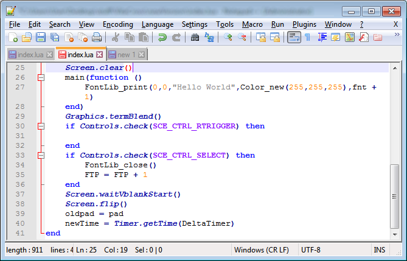

# NotepadPPlpp-vita
Just to adding keywords from lpp-vita to notepad++ to highlight them 
## Screenshot
 
## How to
* Copy content from FUNC2.txt and FUNC3.txt 
* Go Settings -> Style Configurator -> Lua 
* Paste in FUNC2 FUNC3 Style to User-defined keywords 
